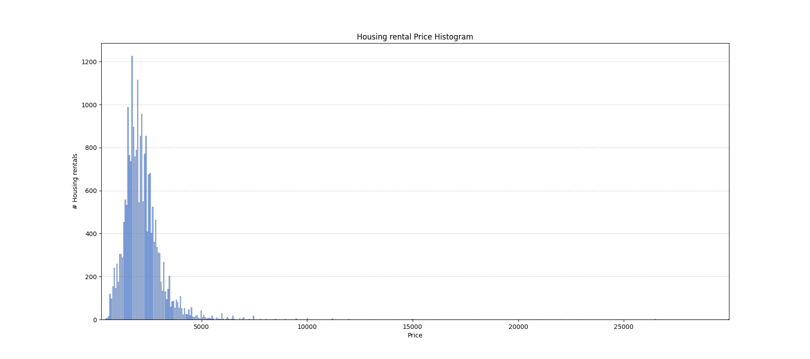
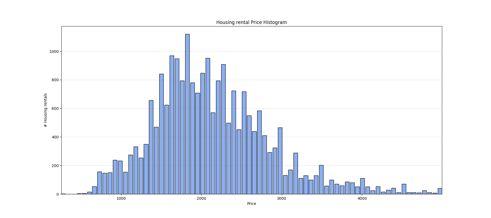
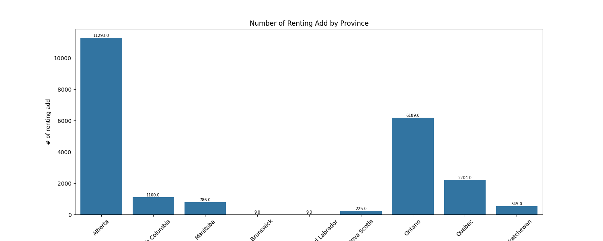
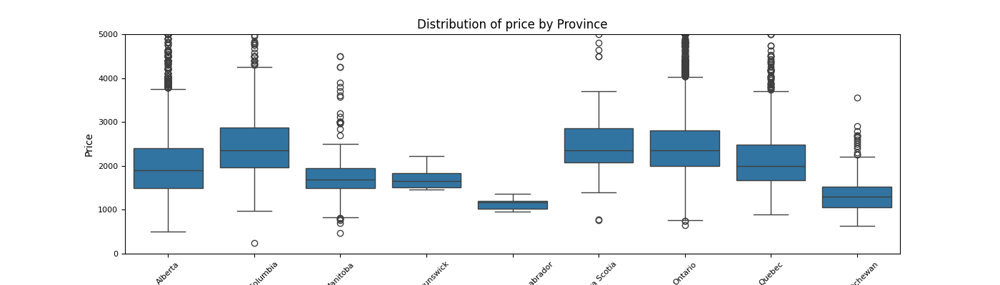
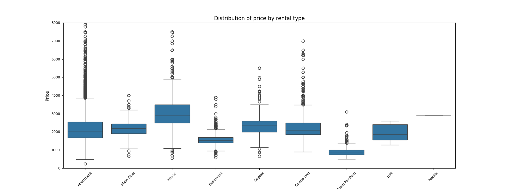
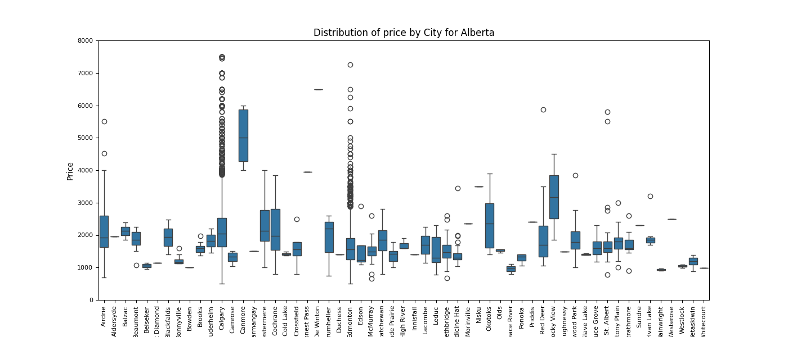
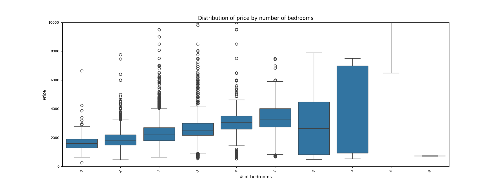
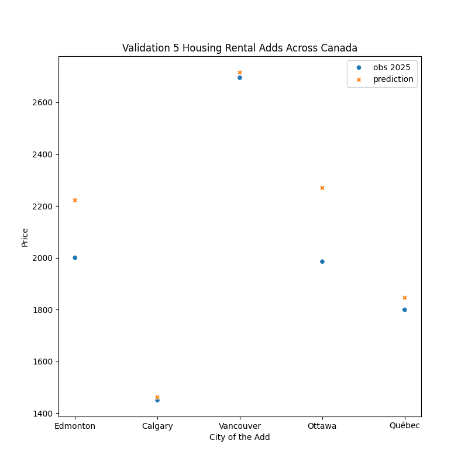

---
### Dataset
---
The original dataset is severely skewed to the left. Having a distribution so far from a normal distribution really impacted the ability to build any performing model. Thus, I decide to remove some of the outliers that represented less than 1.2% of the dataset by limiting the Residential Housing Rental price to 5000$.

Here is the histogramme of the dataset limited at 5000$. 

The distribution from this dataset tend more toward a normal distribution than the previous set. I believe that this dataset will be better suited to build a performing model.

---
### Analysis
---
Here are the keys elements founds during the data analysis

**Under-representativity problems**
A few province are well represented in the dataset.
The rest are under-represented or even almost not represented in the dataset
The models will perform poorly over certain Province, such as - New Brunswick - Newfoundland and Labrador - Northwest Territories, due to under representativity of the sample dataset.

**Province vs Price**
The province itself has an impact on the price of an housing rental across Canada
However, over the well represented province the gap is not significant and the Province itself my not be a significant forecast predictor.

**Price vs Rental Type**
Room for rent, basement and house are going to be good rpedictors since their mean price are distinguishable from the other types.

**Price vs Cities**
Some cities are important predicting factors.

**Price vs Bedrooms**
The number of bedrooms will be a strong predictor of the price.
However, it might not be a linear trend, most likely a x² equation.

---
### Best predictors
---
Two methods were use to select the best predictors. 
1. The features with the highest correlation with Price were selection
2.  SelectKBest function was used to select the best predictors

Here is the top 30 features looks like with the two differents methods

| Produced with hihest Correlation                      | Produced with SelectKBest                      |
|------------------------------|------------------------------|
| baths                        | latitude                     |
| beds                         | longitude                    |
| type_House                   | beds                         |
| city_Toronto                 | baths                        |
| latitude                     | sq_feet                      |
| type_Room For Rent           | lease_term_6 months          |
| province_Ontario             | lease_term_Negotiable        |
| city_Edmonton                | lease_term_Short Term        |
| type_Basement                | type_Basement                |
| province_Saskatchewan        | type_Condo Unit              |
| longitude                    | type_House                   |
| sq_feet                      | type_Room For Rent           |
| dogs                         | smoking_Smoking Allowed      |
| city_Vancouver               | province_British Columbia    |
| lease_term_Short Term        | province_Manitoba            |
| province_Manitoba            | province_Newfoundland and Labrador |
| province_British Columbia    | province_Nova Scotia         |
| city_Winnipeg                | province_Ontario             |
| city_Regina                  | province_Quebec              |
| city_West Vancouver          | province_Saskatchewan        |
| cats                         | city_Calgary                 |
| city_Canmore                 | city_Toronto                 |
| province_Nova Scotia         | city_Edmonton                |
| smoking_Smoking Allowed      | city_Montréal                |
| city_Halifax                 | city_Ottawa                  |
| type_Duplex                  | city_Winnipeg                |
| lease_term_Negotiable        | city_Vancouver               |
| type_Condo Unit              | city_Victoria                |
| lease_term_Long Term         | city_Regina                  |
| city_Victoria                | city_West Vancouver          |

---
### Models
---

| Regression Method   | Predictors (qty chosen)  | Mean Absolute Error | Mean Square Error    | Root Mean Square Error | R2 scores   |
| ------------------- | ----------- | ------------------- | -------------------- | ---------------------- | ----------- |
| Linear              | SelectKBest (15) | 407                | 309293             | 556                   | 0.41           |
|                     | Highest corr (15)| 322                | 200112             | 447                   | 0.62           |
|                     | SelectKBest (20) | 345                | 226796             | 476                   | 0.57           |
|                     | Highest corr (20)| 316                | 194185             | 441                   | 0.63           |
|                     | SelectKBest (30) | 307                | 182991             | 428                   | 0.65           |
|                     | Highest corr (30)| 308                | 185664             | 431                   | 0.65           |
| Polynomial (2nd degree)         | SelectKBest (15) | 319                | 197348             | 444                   | 0.63           |
|                     | Highest corr (15)| 278                | 150742             | 388                   | 0.71           |
|                     | SelectKBest (20) | 302                | 176505             | 420                   | 0.67           |
|                     | Highest corr (20)| 274                | 147937             | 385                   | 0.72           |
|                     | SelectKBest (30) | 263                | 134968             | 367                   | 0.74           |
|                     | Highest corr (30)| 266                | 138808             | 373                   | 0.74           |
| Ordinary Least Square | SelectKBest (15) | 407                | 309293             | 556                   | 0.41           |
|                       | SelectKBest (15) + sq_ft^2 + sin(longitude) | 371                | 261830             | 512                   | 0.50           |
|                     | Highest corr (15)| 322                | 200112             | 447                   | 0.62           |
|                     | Highest corr (15) + sq_ft^2 + sin(latitude) +sin(longitude) + bath² + beds²| 316                | 190964             | 437                   | 0.64           |
|                     | SelectKBest (20) | 345                | 226796             | 476                   | 0.57           |
|                     | SelectKBest (20) + sq_ft^2 + sin(longitude) + bath² | 336                | 213294             | 462                   | 0.60           |
|                     | Highest corr (20)| 316                | 194185             | 441                   | 0.63           |
|                     | Highest corr (20) + sq_ft^2 + sin(latitude) +sin(longitude) + bath² + beds²| 308                | 180525             | 425                   | 0.66           |
|                     | SelectKBest (30) | 307                | 182991             | 428                   | 0.65           |
|                     | SelectKBest (30) + sq_ft^2 + sin(latitude) +sin(longitude) + bath² + beds² + smoking² | 298                | 171348             | 414                   | 0.68           |
|                     | Highest corr (30)| 308                | 185664             | 431                   | 0.65           |
|                     | Highest corr (30) + sq_ft^2 + sin(latitude) +sin(longitude) + bath² + beds² + smoking²| 299                | 172231             | 415                   | 0.67           |

The errors (Mean Absolute, Mean Square and Root Mean Square) are all lower for the polynomial regression model than the linear regression model. A lower error is an indication that the prediction values are closer to the true value.

---
### Model Selected
---

The model built from a polynomial regression with an order of 2 performs better than the linear regression model, since its predicted values are closer to the true values.

The best model was tested on real-time 2025 Residential Housing Rental Adds from [rentfaster.ca](https://www.rentfaster.ca/?utm_source=OOH&utm_medium=sign&utm_campaign=ca)

I chose to sample major cities (Edmonton, Calgary, and Vancouver), the national capital (Ottawa), and a city that might be less well represented by the dataset (Quebec City).

Here are the link to the 5 adds evaluate

[Edmonton](https://www.rentfaster.ca/ab/edmonton/rentals/townhouse/3-bedrooms/king-edward-park/pet-friendly/606335)

[Calgary](https://www.rentfaster.ca/ab/calgary/rentals/basement/1-bedroom/banff-trail/pet-friendly/540714)

[Vancouver](https://www.rentfaster.ca/bc/vancouver/rentals/apartment/1-bedroom/west-end/pet-friendly/579375?-RSYNC)

[Ottawa](https://www.rentfaster.ca/on/ottawa/rentals/apartment/1-bedroom/byward-market/pet-friendly/559539?-RSYNC)

[Quebec City](https://www.rentfaster.ca/qc/quebec/rentals/apartment/2-bedrooms/non-smoking/315473?-RSYNC)

---
### Validation
---

The model perform relatively well on the sample 2025 dataset. I understand that a larger sample dataset from 2025 would be been preferable to draw sigificant conclusion. Due to some time limitation, I sampled only 5 adds for 2025.

The RMSE is small with a value of 163.

---
### Conclusion
---
I believe the model is acceptable at the moment. Validation with a larger 2025 dataset would be require to make a more robust conclusion about the model's performance.